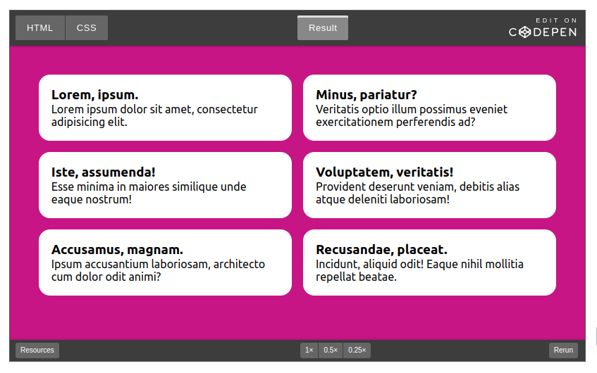
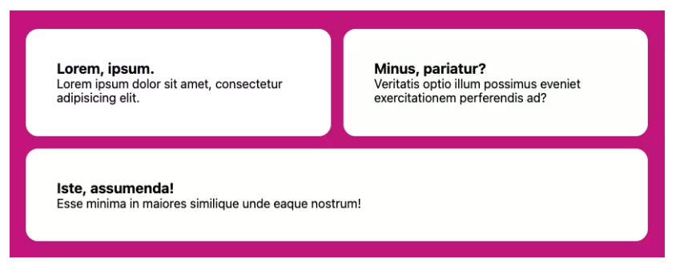
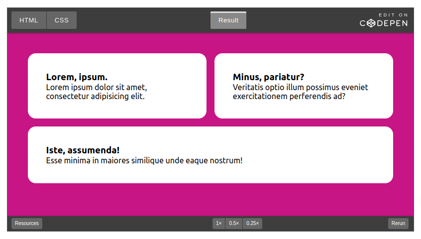
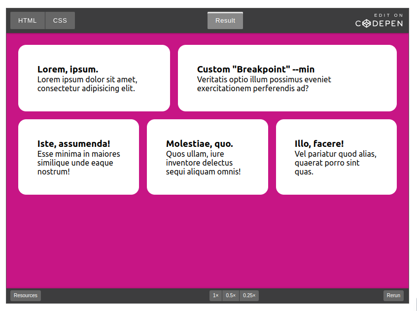

# Responsive CSS lưới bố cục không cần Media Queries

Nền tảng của nhiều trang web tiếp tục là lưới bố cục, cho dù đó là Grid hay Flexbox. Trong đoạn trích này từ [Giải phóng sức mạnh của CSS: Kỹ thuật nâng cao cho giao diện người dùng đáp ứng](https://www.sitepoint.com/premium/books/unleashing-the-power-of-css/), chúng ta sẽ xem cách cả hai công cụ này cung cấp các cách để tạo lưới bố cục phản hồi linh hoạt mà không cần truy vấn phương tiện.

## Responsive bố cục với Grid

Đầu tiên có lẽ là giải pháp tôi yêu thích nhất trong số tất cả các giải pháp vì tính linh hoạt và dễ sử dụng của nó. Sử dụng Grid, chúng ta có thể tạo một tập hợp các cột đáp ứng để tự tạo khi cần. Chúng tôi sẽ cung cấp một ràng buộc duy nhất - chiều rộng tối thiểu mà các cột có thể có - thực hiện nhiệm vụ kép như một loại "điểm dừng" trước khi các mục cột chia thành các hàng mới.

Đây là tất cả những gì cần thiết để hoàn thành bố cục lưới đáp ứng này, trong đó kích thước cột tối thiểu của chúng tôi được đặt thành `30ch` thông qua thuộc tính tùy chỉnh của trình trợ giúp. Quy tắc này hướng dẫn trình duyệt tạo bao nhiêu cột có chiều rộng tối thiểu `30ch` tùy thích:

```php
.grid {
  --min: 30ch;

  display: grid;
  grid-template-columns: repeat(auto-fit, minmax(min(100%, var(--min)), 1fr));
}
```
Vì `1fr` là giá trị “tối đa” của `minmax()` nên các cột cũng được phép kéo dài để lấp đầy mọi khoảng trống còn lại một cách công bằng trong một hàng. Vì vậy, nếu không gian có sẵn là `80ch` và có hai lưới con, mỗi lưới sẽ chiếm `40ch`. Nếu có ba đứa trẻ, đứa thứ ba sẽ ở hàng thứ hai, vì `80` không chia đều cho kích thước tối thiểu cho phép là `30`.

Bản demo [CodePen](https://codepen.io/SitePoint/pen/NWOGvvN?editors=1100) sau đây cung cấp một ví dụ trực tiếp về bố cục Lưới đáp ứng.



## Responsive bố cục với Flexbox
Chúng ta có thể đạt được trải nghiệm tương tự với Flexbox. Sự khác biệt giữa giải pháp Flexbox và Grid là các mục lưới chuyển sang một hàng mới không thể mở rộng trên nhiều cột lưới. Với Flexbox, chúng ta có thể hướng các mục linh hoạt phát triển để lấp đầy tất cả không gian thừa còn lại, ngăn chặn tình trạng “mồ côi” xuất hiện với giải pháp Grid.

Trong mã này, cũng như trong mã Lưới, trình duyệt sẽ tạo bao nhiêu cột vừa với không gian nội tuyến với kích thước `--min` ít nhất là `30ch`. Nếu chúng ta có ba mục và mục thứ ba cần chuyển sang hàng mới, nó sẽ chiếm không gian còn lại do tốc ký `flex`, điều quan trọng là đặt `flex-grow` thành `1`. Do đó, nó có hành vi tương tự như `1fr` trong hầu hết các trường hợp:
```php
.flexbox-grid {
  --min: 30ch;

  display: flex;
  flex-wrap: wrap;
}

.flexbox-grid > * {
  flex: 1 1 var(--min);
}
```
Hình ảnh bên dưới hiển thị mục cuối cùng trong danh sách được đánh số lẻ trải dài trên hai cột nhờ thuộc tính `flex-grow`.



*Lưu ý: trong cả giải pháp Grid và Flexbox, nếu chúng ta thêm một [khoảng trống](https://www.sitepoint.com/css-gap-property/), khoảng trống đó sẽ bị trừ đi khi tính toán số lượng cột có thể được tạo trước khi thêm hàng mới.*

Những độc giả tinh ý có thể đã nhận thấy một điểm khác biệt quan trọng khác giữa các giải pháp này: khi sử dụng Grid, phần cha mẹ sẽ xác định hành vi của phần con. Đối với Flexbox, chúng tôi đặt hành vi bố cục con cho các phần tử con. Các bộ tốc ký `flex`, theo thứ tự, `flex-grow`, `flex-shrink` và `flex-basis`.

Như một thử nghiệm, chúng ta có thể thay đổi giá trị `flex-grow` thành `0` và xem các mục sẽ chỉ mở rộng đến giá trị `flex-basis` như thế nào. (Thử nghiệm với bản demo CodePen bên dưới.) Điều quan trọng là giữ `flex-shrink` thành `1`, để cuối cùng — khi không gian nội tuyến có sẵn hẹp hơn `flex-basis` — các mục vẫn được phép “thu nhỏ”, vì điều này sẽ giúp ích để tránh tràn.

Bản [demo CodePen](https://codepen.io/SitePoint/pen/WNaQMeO?editors=1100) sau đây cho thấy cách bố trí Flexbox của chúng tôi đang hoạt động.



Thuộc tính `flex-basis` có thể được điều chỉnh thêm cho giải pháp này để chỉ định các “điểm dừng” duy nhất cho các mục khác nhau. Vì chúng tôi đang đặt giá trị đó thông qua thuộc tính tùy chỉnh --min và các phần tử con Flexbox kiểm soát kích thước của riêng chúng, nên chúng tôi có thể điều chỉnh giá trị đó theo kiểu nội tuyến:

```php
<li style="--min: 40ch">...</li>
```

Các phần tử con khác của danh sách trong ví dụ này vẫn sẽ chạy xung quanh nó và sử dụng `30ch` từ quy tắc cơ bản, nhưng cột rộng hơn sẽ thay đổi hành vi một cách hiệu quả.

Đây là bản [demo CodePen](https://codepen.io/SitePoint/pen/GRYpQJZ?editors=1100) của mã này đang hoạt động.



Dưới đây là hai kỹ thuật Flexbox khác sử dụng `flex-grow` và `flex-basis` theo những cách thú vị:

- [Flexbox Holy Albatross](https://heydonworks.com/article/the-flexbox-holy-albatross-reincarnated/) của Heydon Pickering, được chia nhỏ từ các cột thành một hàng dựa trên tổng chiều rộng của vùng chứa chính.

- [Bố cục thanh bên](https://every-layout.dev/layouts/sidebar/) của Heydon 
Pickering và Andy Bell, cho thấy cách buộc các điểm dừng khác nhau dựa trên Flexbox để kiểm soát tốt hơn thời điểm gói các mục.

Bài viết này được trích từ [Giải phóng sức mạnh của CSS: Kỹ thuật nâng cao cho giao diện người dùng đáp ứng](https://www.sitepoint.com/premium/books/unleashing-the-power-of-css/), có sẵn trên SitePoint Premium.

Link bài dịch: https://www.sitepoint.com/responsive-css-layout-grids-without-media-queries/